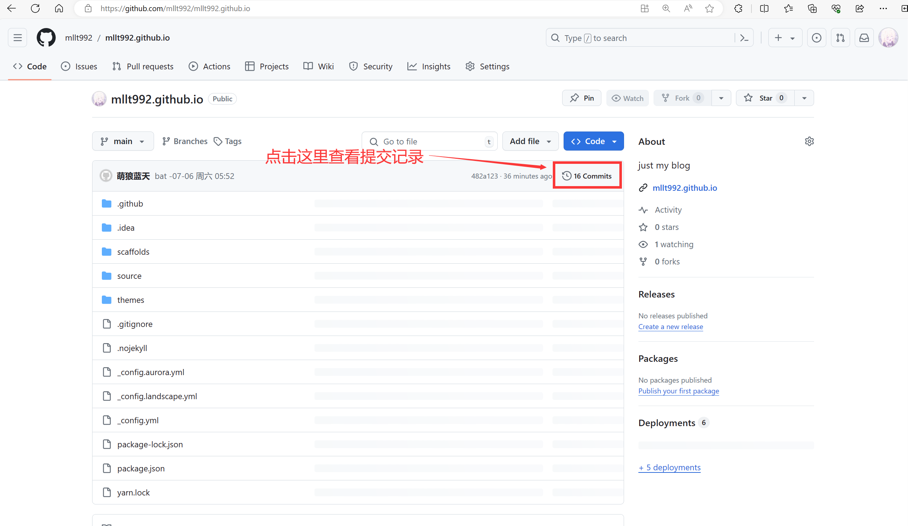
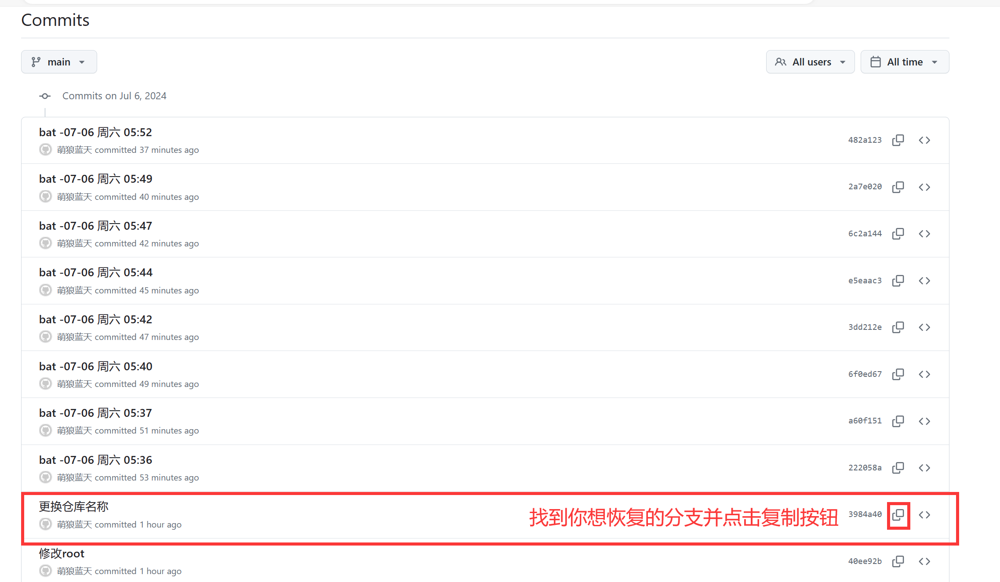
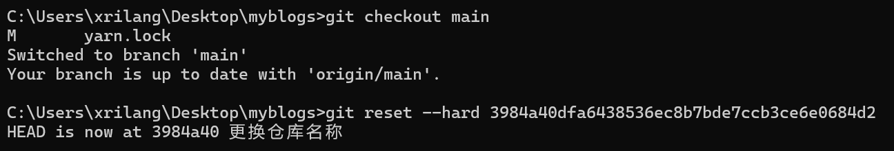
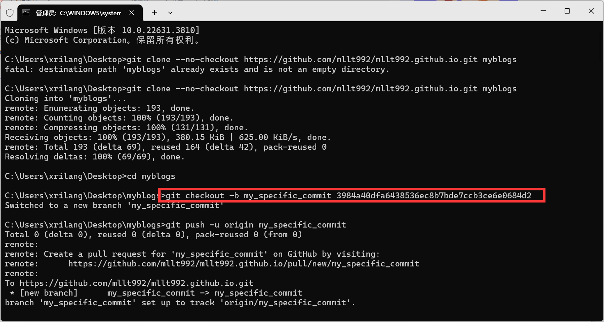

项目搞崩了，还提交上去了怎么办？

那当然是恢复到之前的提交记录了，那怎么操作呢？

首先，到代码托管平台找到你想恢复的提交记录（在此以github为例）

### 获取 commit id

首先，通过如下图操作获取到commit id





### 直接恢复

切换到你要恢复的分支（比如就是主分支搞坏了，我要把主分支恢复一下……）

 `git checkout main`

然后恢复 

`git reset --hard 在此输入你的commit-id`



### 备份恢复

也许你的主分支搞崩了，但是还存在着你需要的东西，不能直接恢复

那么，你可以将你想要的提交，恢复成一个新的分支



`git checkout -b 新的分支名称 你的commit-id`
