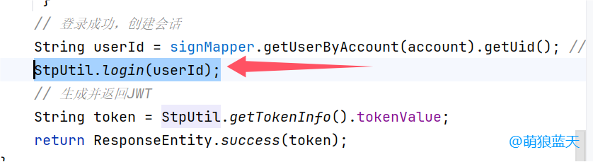
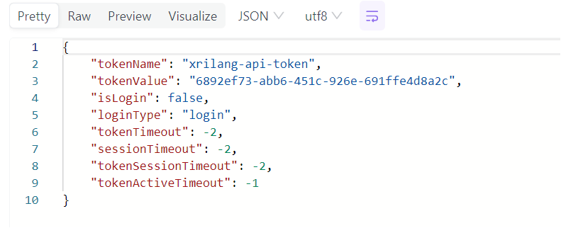

本项目采用权限认证框架[sa-token](httpssa-token.cc)（[sa-token-solon-plugin](httpssolon.noear.orgarticle110)）

## pom.xml

```xml
<!--        鉴权-->
<dependency>
    <groupId>org.noear</groupId>
    <artifactId>sa-token-solon-plugin</artifactId>
</dependency>
```

## 配置

```yml
# sa-token配置
sa-token:
  # token名称 (同时也是cookie名称)
  token-name: xrilang-api-token
  # token有效期，单位s 默认30天, -1代表永不过期
  timeout: 2592000
  # token临时有效期 (指定时间内无操作就视为token过期) 单位: 秒
  activity-timeout: -1
  # 是否允许同一账号并发登录 (为true时允许一起登录, 为false时新登录挤掉旧登录)
  allow-concurrent-login: true
  # 在多人登录同一账号时，是否共用一个token (为true时所有登录共用一个token, 为false时每次登录新建一个token)
  is-share: true
  # token风格
  token-style: uuid
  # 是否输出操作日志
  is-log: false
```

app.yml配置sa-token

## 登录认证

### 登录成功

> 相关资料：[登录认证 (sa-token.cc)](https://sa-token.cc/doc.html#/use/login-auth)

首先是登录，登录成功了，调用`StpUtil.login()`方法,保存用户ID




该方法会自动生成token、token有效期等信息，和用户ID一起保存在Cookie当中



大致就是如上图这样的一些信息。

### 登录认证相关接口


这些方法官方文档有介绍，写成接口方便查询和操作。比如退出登录、查询token信息等等。

```

    // 查询登录状态，浏览器访问： http://localhost:9420/sign/isLogin
    @Mapping("/isLogin")
    public String isLogin() {
        return "当前会话是否登录：" + StpUtil.isLogin();
    }

    /**
     * 获取登录用户的id
     * @return String
     */
    @Mapping("/loginId")
    public String loginId() {
        return StpUtil.getLoginIdAsString();
    }

    /**
     *  获取登录用户的token
     * @return String
     */
    @Mapping("/loginToken")
    public String loginToken() {
        return StpUtil.getTokenValue();
    }

    /**
     * 退出登录
     * @return String
     */
    @Mapping("/logout")
    public String isLogout() {
        ;
        StpUtil.logout();
        return loginId()+"退出登录";
    }

    @Mapping("/token_timeout")
    public Long getTokenTimeout(String account) {
        return StpUtil.getTokenTimeout();
    }

    /**
     * 获取当前会话的 token 信息参数
     * return
     */
    @Mapping("/tokenInfo")
    public SaTokenInfo getTokenInfo() {
        return StpUtil.getTokenInfo();
    }
```

## 路由拦截

> 相关参考资料：[路由拦截鉴权 (sa-token.cc)](https://sa-token.cc/doc.html#/use/route-check)

sa-token-solon-plugin和sa-token的写法可能会有一点区别。

这里使用的是sa-token-solon-plugin

首先注解是`@Configuration`

```
package cc.mllt.xrilang.WebConfig;


import cn.dev33.satoken.context.SaHolder;
import cn.dev33.satoken.router.SaRouter;
import cn.dev33.satoken.solon.integration.SaTokenInterceptor;
import cn.dev33.satoken.stp.StpUtil;
import org.noear.solon.annotation.Bean;
import org.noear.solon.annotation.Component;
import org.noear.solon.annotation.Configuration;
import org.noear.solon.core.handle.Context;
import org.noear.solon.core.handle.Filter;
import org.noear.solon.core.handle.FilterChain;
import org.smartboot.http.common.logging.Logger;
import org.smartboot.http.common.logging.LoggerFactory;

@Configuration
public class AppFilter implements Filter {

    private static final Logger log = LoggerFactory.getLogger(AppFilter.class);

    @Bean
    public SaTokenInterceptor saTokenInterceptor() {
        return new SaTokenInterceptor()
                .addInclude("/**/**")
                .addExclude("/favicon.ico")
                .addExclude("/sign/**")
                .setAuth(req -> {
                    SaRouter.match("/**", StpUtil::checkLogin)
                            .match("/user/**", r -> StpUtil.checkPermission("user"))
                            .match("/admin/**", r -> StpUtil.checkPermission("admin"));
                })
                .setError(e -> {
                    log.error("未登录的非法请求。"+e.getMessage());
                    return "未登录";
                })
                .setBeforeAuth(req -> {
                    SaHolder.getResponse()
                            .setServer("xrilang-api-server")
                            .setHeader("X-Frame-Options", "SAMEORIGIN")
                            .setHeader("X-XSS-Protection", "1; mode=block")
                            .setHeader("X-Content-Type-Options", "nosniff");
                });
    }

    @Override
    public void doFilter(Context ctx, FilterChain chain) throws Throwable {
        long start = System.currentTimeMillis();
        try {
            chain.doFilter(ctx);
            if (!ctx.getHandled()) {
                ctx.status(404);
                ctx.output("Resource not found.");
            }
        } catch (Throwable e) {
            ctx.status(500);
            ctx.output(e.getMessage());
            // 错误已经被 `setError` 方法记录，这里不再重复记录
        }
        long timeTaken = System.currentTimeMillis() - start;
        log.info("Request processed in {} ms", timeTaken);
    }
}
```

关键的地方在于

```java
    public SaTokenInterceptor saTokenInterceptor() {
        return new SaTokenInterceptor()
                .addInclude("/**/**")
                .addExclude("/favicon.ico")
                .addExclude("/sign/**")
                .setAuth(req -> {
                    SaRouter.match("/**", StpUtil::checkLogin)
                            .match("/user/**", r -> StpUtil.checkPermission("user"))
                            .match("/admin/**", r -> StpUtil.checkPermission("admin"));
                })
                .setError(e -> {
                    log.error("未登录的非法请求。"+e.getMessage());
                    return "未登录";
                })
                .setBeforeAuth(req -> {
                    SaHolder.getResponse()
                            .setServer("xrilang-api-server")
                            .setHeader("X-Frame-Options", "SAMEORIGIN")
                            .setHeader("X-XSS-Protection", "1; mode=block")
                            .setHeader("X-Content-Type-Options", "nosniff");
                });
    }

```

这个方法无需被调用。

配置好放行哪些，不放行哪些，错误返回信息就行。

## Session会话

> 相关资料：[Session会话 (sa-token.cc)](https://sa-token.cc/doc.html#/use/session)


具体使用方法以后再更新。

## 集成redis

> 参考资料：[集成 Redis (sa-token.cc)](https://sa-token.cc/doc.html#/up/integ-redis?id=方式2、sa-token-整合-redis（使用-jackson-序列化方式）)

这里使用官方文档的第二种方式集成redis

所有`pom.xml`现在是

```xml
<!--        鉴权-->
        <dependency>
            <groupId>org.noear</groupId>
            <artifactId>sa-token-solon-plugin</artifactId>
        </dependency>
```


```xml
<!--鉴权-redis-序列化-->
        <!-- Sa-Token 整合 Redis （使用 jackson 序列化方式） -->
        <dependency>
            <groupId>cn.dev33</groupId>
            <artifactId>sa-token-redis-jackson</artifactId>
            <version> 1.38.0</version>
        </dependency>
        <!-- Jackson 的 JSR310 支持模块 -->
        <dependency>
            <groupId>com.fasterxml.jackson.datatype</groupId>
            <artifactId>jackson-datatype-jsr310</artifactId>
            <version> 2.17.2</version>
        </dependency>
        <!-- 提供Redis连接池 -->
        <dependency>
            <groupId>org.apache.commons</groupId>
            <artifactId>commons-pool2</artifactId>
            <version> 2.11.1</version>
        </dependency>
        <dependency>
            <groupId>org.redisson</groupId>
            <artifactId>redisson</artifactId>
            <version> 3.21.3</version> 
        </dependency>
```

然后配置redis连接信息

**集成 Redis 后，是我额外手动保存数据，还是框架自动保存？**
框架自动保存。集成 `Redis` 只需要引入对应的 `pom依赖` 即可，框架所有上层 API 保持不变。

我是创建了一个RedisConfig.java文件，代码如下

```java
package cc.mllt.xrilang.WebConfig;

import cn.dev33.satoken.dao.SaTokenDao;
import cn.dev33.satoken.solon.dao.SaTokenDaoOfRedissonJackson;
import org.redisson.Redisson;
import org.redisson.api.RedissonClient;
import org.redisson.config.Config;
import org.noear.solon.annotation.Bean;
import org.noear.solon.annotation.Configuration;
import org.noear.solon.annotation.Inject;
import org.smartboot.http.common.logging.Logger;
import org.smartboot.http.common.logging.LoggerFactory;

@Configuration
public class RedisConfig {
    static Logger log = LoggerFactory.getLogger(RedisConfig.class);

    @Inject(value="${redis.host}", autoRefreshed = true)
    private String host;

    @Inject(value="${redis.port}", autoRefreshed = true)
    private int port;

//    @Inject(value="${redis.password}", autoRefreshed = true)
//    private String password;

    @Bean
    public RedissonClient redissonClient() {
        try {
            Config config = new Config();
            config.useSingleServer()
                    .setAddress("redis://" + host + ":" + port)
                    .setDatabase(1); // 使用配置中的数据库索引
//                .setPassword(password);
            RedissonClient redisson = Redisson.create(config);
            log.info("连接redis成功");
            return redisson;
        }catch (Exception e){
            log.error("连接redis失败，请检查Redis配置信息并先启动redis", e);
            return null;
        }
    }

    @Bean
    public SaTokenDao saTokenDao(RedissonClient redissonClient) {
        return new SaTokenDaoOfRedissonJackson(redissonClient);
    }
}
```

