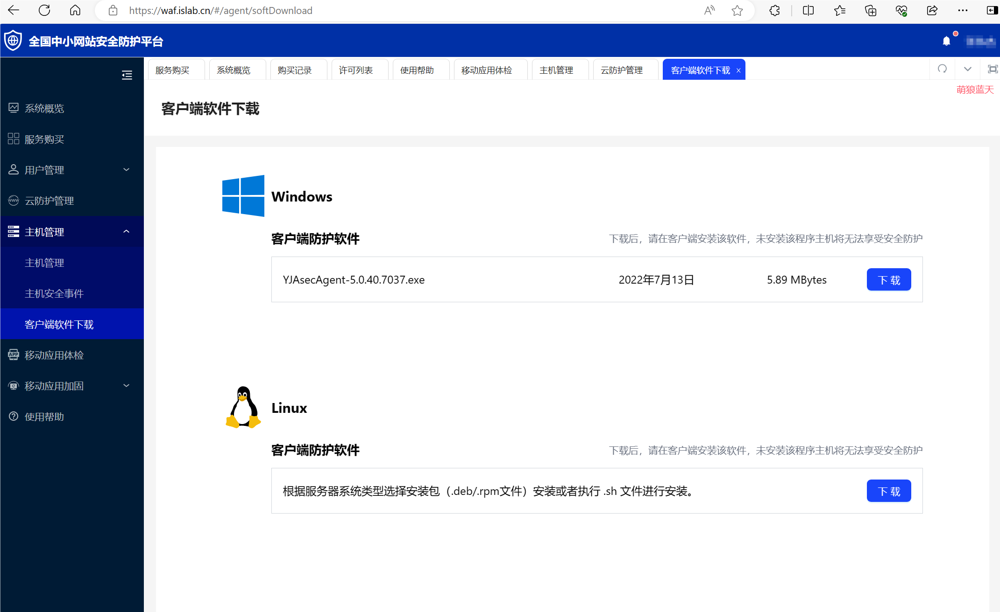

# 用上免费的服务器保护措施

我一直觉得没人会来攻击我的服务器，毕竟我没啥值钱的数据。

但是……

直到我买了1Panel专业版体验了一下它的WAF功能，我才发现，还真有人想攻击我的服务器或者网站！比如说，在我服务器上留个后门！




可以看到有两百多页的拦截，好吧，这的确让我重视起来服务器的安全问题。但是我不可能去花费大量的钱钱去购买一些防护软件，于是我就研究了一下免费的防护方式。


## 关于端口

我在很早以前都是直接在服务器供应商上放行全部端口，因为懒添加网站的时候还要特意登录服务器供应商控制台去一个一个放行端口。

但是，显然这是极度危险的，在不采用运维管理面板（例如宝塔，1panel之类自带防火墙的）的情况下，建议还是不要全部放行。

我目前的做法就是，在服务器供应商上放行大部分端口，然后在运维管理面板（例如宝塔，1panel之类自带防火墙的）上开启防火墙，限制端口，这样比较方便。


## 借助**中小网站安全防护平台**

地址：https://waf.islab.cn/

这个平台提供两台主机的免费防护。




先去下载合适的客户端，放在主机上。（话说为什么要用百度盘下载……）

将下载的文件上传到服务器，然后执行这个文件




详细教程：[使用帮助 - 全国中小网站安全防护平台 (islab.cn)](https://waf.islab.cn/#/help/index)




如果使用sh文件安装失败了，就换一个文件，比如我的CentOS Stream ，使用sh这个文件就是安装失败了，于是我去下载rpm文件

```
sudo rpm -i ./YJAsecAgent-5.0.40.7037-47.92.93.39-443-vflwSLxU.el7.x86_64.rpm
```

安装完毕后，生成主机标识文件

> 客户端软件安装成功后，执行命令“/usr/local/YJAsec/edrcid”。如果当前登录的root用户，生成的主机标识文件路径为“/root/edrcid.json”。如果是普通用户则生成的主机标识文件路径为“/home/user1/edrcid.json”。 “user1”为对应的普通用户名。

我的身份和系统，可以执行命令`/usr/local/YJAsec/edrcid`




很好，找到我们的JSON文件，下载下来




回到网站，点击【主机管理】新增一台主机，填上自己的主机信息和个人信息




然后点击激活主机，上传刚刚下载的标识文件




你也可以在新增的时候就上传主机标识文件

## 雷池

雷池WAF社区版好吧挺酷的，要不是它价格太贵了我真想买个专业版。

它的实现原理就是反向代理，附上一张我画的丑图：




雷池官网：[安装雷池 | 雷池 WAF 社区版 (chaitin.cn)](https://waf-ce.chaitin.cn/docs/guide/install)

一键安装，很简单，注意：安装完会在终端里面显示账号密码和访问地址，记得保存下来。




接下来我举个例子，告诉你如何使用。


1.登录雷池管理面板，先修改账号密码为自己记得的……




2 点开防护站点 - 站点管理 - 添加站点




如果你要开启SSL的话，按提示申请证书就行。

比如域名 mllt.cc 原本直接解析到 192.168.1.10:8080

你设置端口为9090，上游服务器为  192.168.1.10:8080

这个时候你访问mllt.cc ，请求到达9090端口，确认请求安全且正常之后，就转发给端口8080

然后其他的一些配置，自己摸索去吧，或者看官方文档也行。


## 阿里云盾

话说……买的阿里云的服务器似乎会自带阿里云盾。防护信息可以去阿里云的  云安全中心 查看




准确说不叫防护，防护功能他收费，只是能看到风险，然后自己根据这些风险提示，想办法去处理吧。